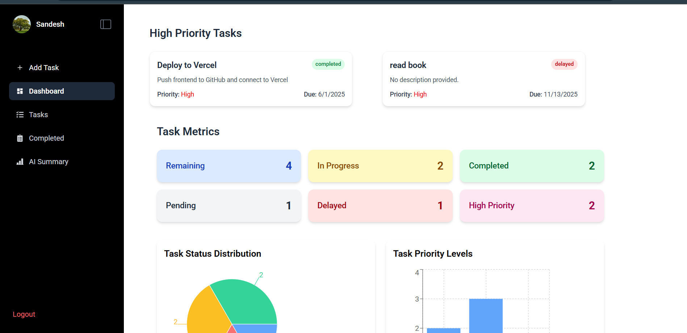
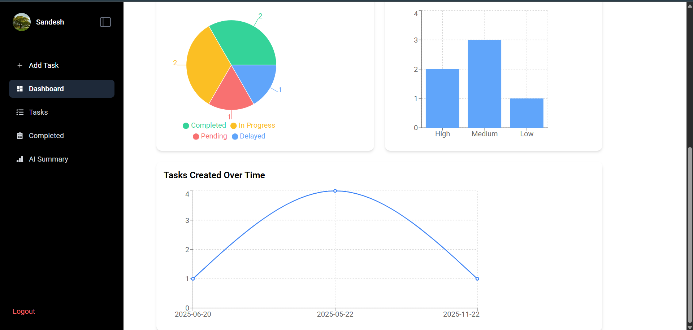
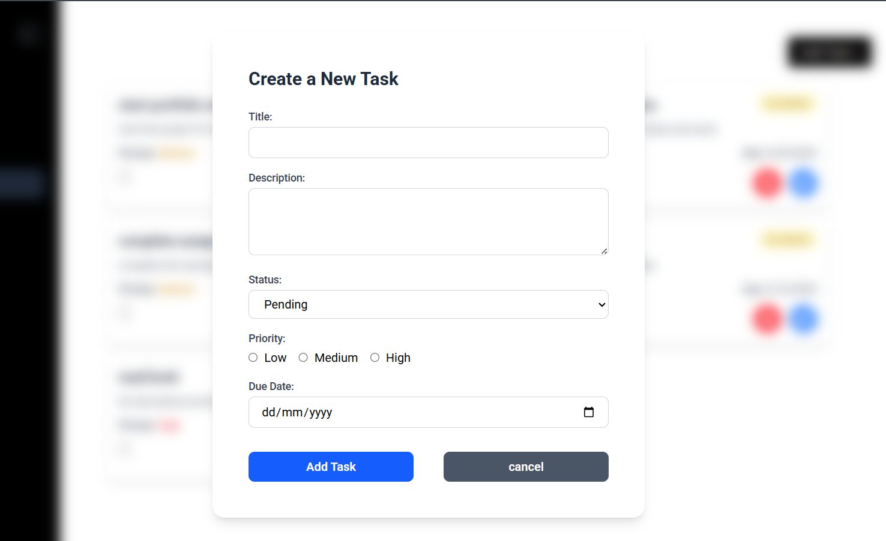

## Task Manager
A full stack web application where users can manage their task easily.

## Description
This is a MERN stack application where frontend is built using React and backend is build using express and MongoDB database. This application allows the user to create task with certain properties. User can create, read, update and delete the task.


## Table of content
- [Key Feature](#key-features)
- [Technologies Used](#technologies-used)
- [Installation](#installation)
- [Screenshots](#screenshots)

## key features
- **Operations :** create, read, update and delete task ( manage tasks with properties such as title, description, status, priority, and due date.)
- **Authentication :** Users are authenticated using the JWT 
- **User Dashboard :** Allows user to monitor the task created through different graphs
- **AI Summary :** generates the summary or report of all the task


## Technologies used
- **Frontend :** React, RTK, Tailwind css, axios, gemini
- **Backend :** NodeJS, Express, JWT
- **Database :** MongoDB


## Installation
**1. Clone Repository**
```bash
git clone git@github.com:Sandesh-Ghimire0/task-management-frontend.git
```

**2. Install Dependencies**
1. Backend Dependencies
```bash
cd backend
npm install
```
2. Frontend Dependencies
```bash
cd frontend
npm install
```

**3. Run server**\
(for both backend and frontend)
```bash
npm run dev
```

## Screenshots





